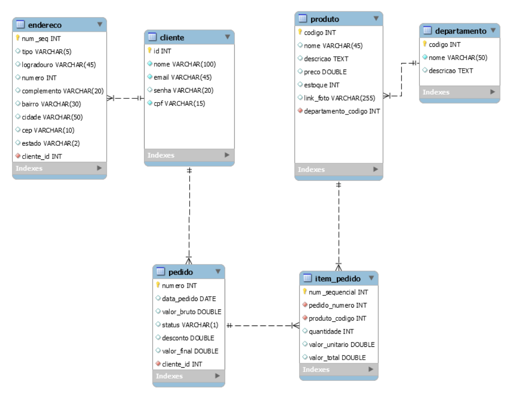

  

Desafio HandsOn - MySQL

<a href="#sobre-o-projeto">Sobre</a> •
 <a href="#objetivo">Objetivo</a> • 
 <a href="#imagens-do-projeto">Imagens</a> •
 <a href="#como-rodar">Como rodar</a> •
 <a href="#exercícios-propostos">Exercícios Propostos</a> •
  <a href="#tecnologias">Tecnologias</a> •
  

  
 
## Sobre o projeto 

Desafio em trio proposto pela <a href="https://www.gama.academy">Gama Academy</a>, onde precisávamos manipular tabelas do banco de dados.

  
 
##  Objetivo

Manipular tabelas usando principalmente conceitos como  SELECT, INSERT, CREATE e funções como COUNTER, INNER JOIN, GROUP BY, ASC, DESC e LIMIT.

  
 
## Imagens do projeto
- Tabelas

  

## Como rodar
- Instalar MySQL workbench
- Copiar e colar a criação de tabelas e inserção de itens nas tabelas
- Copiar e colar os comandos para solução dos exercícios

  

## Exercícios propostos
- Quantos clientes estão cadastrados na sua base?

- Qual o produto mais caro?

- Qual o produto mais barato?

- Mostre todos os produtos com seus respectivos departamentos.

- Quantos produtos há em cada departamento? Exiba o nome do departamento e a quantidade de produtos que há em cada um. (pense em SUM e GROUP BY)

- Mostre os dados dos pedidos, incluindo nomes dos clientes e nomes dos produtos que foram vendidos.

- Mostre quantos pedidos foram feitos por mês no ano de 2022 (caso você tenha registros neste ano, senão escolha um ano que você tenha cadastrado - Novamente pense em COUNT e GROUP BY).

- Mostre quanto foi faturado por mês (leve em conta o valor total de cada pedido - novamente pense em GROUP BY e SUM).

- Mostre o valor total do estoque por departamento.

  

## Tecnologias

  

## Contribuidores

<table>
    <tr>
        <td align="center">
            <a href="https://www.linkedin.com/in/henrique-lauar-64a308217/">
                 
                
                    <b>Henrique Lauar</b>
                
            </a>
        </td>
        <td align="center">
            <a href="https://github.com/kevinfinalboss">
                 
                
                    <b>Kevin Gomes</b>
                
            </a>
        </td>
        <td align="center">
            <a href="https://github.com/karennabarrete">
                 
                
                    <b>Karen Nabarrete</b>
                
            </a>
        </td>
    </tr>
</table>
